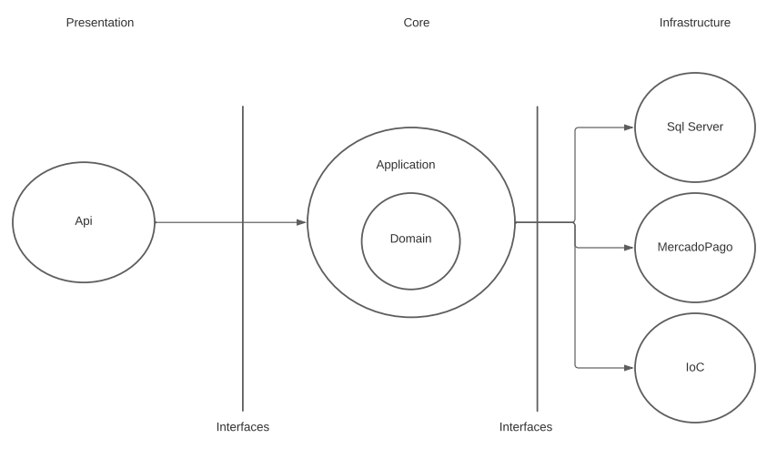
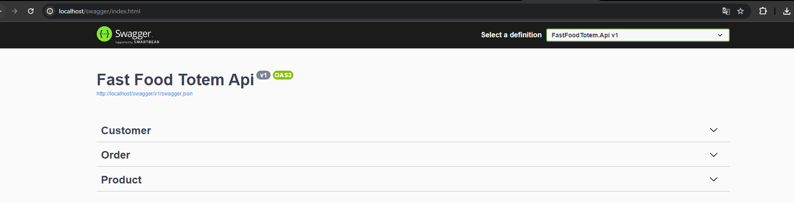
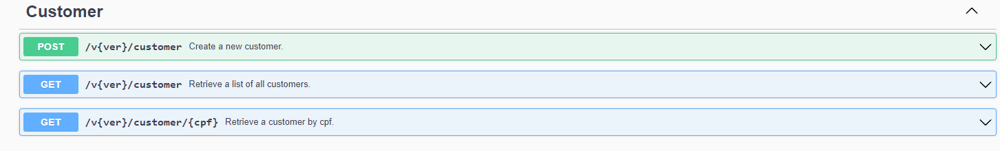
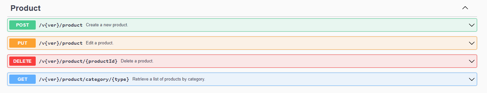
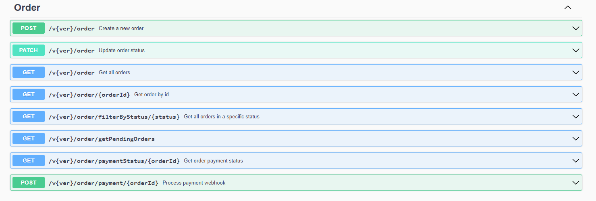
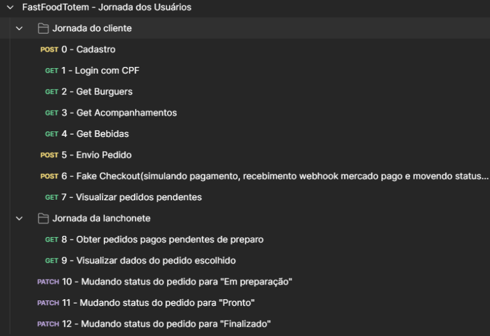

[](https://www.gnu.org/licenses/gpl-3.0)


# FIAP: Pós Tech - Software Architecture

[](https://postech.fiap.com.br/?gad_source=1&gclid=Cj0KCQjwhfipBhCqARIsAH9msbmkyFZTmYIBomPCo-sGkBPLiiZYAkvTmM1Kx-QjwmYs3_NhyPKvP44aAtdZEALw_wcB)

## Objetivo do projeto
Este projeto foi realizado como parte de um entregável para o curso 'Pós Tech - Software Architecture'.
O desafio proposto da fase 1 é realizar um projeto (MVP) monolito utilizando a arquitetura hexagonal para atender as necessidades de um autoatendimento de um fast food.
O desafio proposto da fase 2 é adicionar clean code no projeto e trabalhar com o k8s, usando escalabilidade.


Funcionalidades:
* Gerenciamento de produtos.
* Gerencimento de clientes.
* Realizar um pedido e acompanhar.
* Pagamento via QRCode do Mercado Pago.

Links úteis:
* [Documentação detalhada](https://docs.google.com/document/d/1YhRbWbEMPwUHi4J2lIz5dQMwZ6KrRzot/edit?usp=sharing&ouid=109865710704677504404&rtpof=true&sd=true).

## Arquitetura do projeto
O projeto foi desenvolvido utilizando o .NET 6, tendo como SGBD o Sql Server e utilizando a Clean Architecture, conforme foi solicitado.

Diagrama de arquitetura do projeto:



Observando o desenho da arquitetura utilizada, é possível diferenciar o projeto em 3 camadas: Presentation, Core e Infrastructure.

O Core é a parte central do projeto, existe para isolar as regras de negócio da aplicação e garantir o funcionamento da mesma independente das integrações utilizadas. O core não depende de nenhuma outra camada da aplicação. No core de nossa API, implementamos duas Libraries, Application e Domain.

A camada Application é responsável por trabalhar com todos os DTO’s da API, trafegar os dados entre a API e o Domain, validar os dados de entrada e implementar as regras do negócio com UseCases. 

A camada de Domain é responsável por mapear todas as entidades do negócio. Essa camada também faz o mapeamento dos contratos(interfaces) utilizados para chamar operações de outras camadas, mas não faz a implementação desses contratos, tendo em vista que isso é de responsabilidade das camadas específicas que seguirão esses contratos. É importante ressaltar que essa camada não depende de nenhuma outra, e a camada Application depende apenas da camada Domain. Com essa dependência, a camada Application consegue se integrar com outras camadas através das interfaces implementadas na camada Domain.

A camada de Infrastructure pode ser subdividida em três subcamadas no nosso projeto: SqlServer(integração com sgbd, execução de queries), MercadoPago(integração para gerar QR code e fazer fake checkout) e IoC(injeção de dependências). Nessa camada, são implementados alguns dos contratos especificados na camada Domain. Utilizando os contratos(interfaces) e a injeção de dependências, conseguimos isolar o funcionamento de cada um dos pacotes na infrastructure sem a necessidade do Core ter qualquer dependência deles.

A camada Presentation é responsável por controlar as requisições externas ao domínio e encaminhá-las ao mesmo. Nossa aplicação possui apenas uma camada de apresentação, que é nossa Api.

É possível perceber pela imagem da arquitetura utilizada que ela está um pouco diferente da imagem tradicional da Clean Architecture, mas deixamos dessa forma para tentar deixar mais explicito como que ocorrem as comunicações entre as camadas. As dependências entres os projetos foram desenvolvidas de acordo com a Clean Architecture, que é o mais importante.

## Kubernetes
A seguinte seção tem por objetivo explicar como arquitetamos a infra do produto.

### Diagrama da arquitetura


  
## Pré-requisitos
* [K8s](https://kubernetes.io/pt-br/docs/home/)							
	* O K8s é obrigatório ter instalado na máquina para subir o projeto e possíveis serviços adjacentes, para isso é recomendado utilizar o docker e habilitar o Kubernets nele, porém para isso ter várias outras maneiras de chegar no mesmo resultado, caso prefira consultar a [documentação](https://docs.docker.com/desktop/kubernetes/).
	* Recomendado criar um namespace próprio para o projeto.
* [Docker Desktop](https://www.docker.com/products/docker-desktop/)
	* Para criar o node do kubernets de forma mais fácil e rápida, ajudando também a subir a imagem.
* [K9s](https://k9scli.io/) - Não obrigatório porém aconselhado por ser mais intuitivo.
* [Postman](https://www.postman.com/downloads/) - Não obrigatório.

## Como rodar localmente
Para rodar o projeto localmente necessita abrir um terminal na pasta base, ***entrar na pasta k8s*** executar os seguintes comando:

Caso tenha seguido pela instalação do k8s junto com o docker desktop é possível utilizar o contexto dele da seguinte forma:
```yaml
kubectl config get-contexts
kubectl config use-context docker-desktop
```

> Para criar um namespace para o projeto e configurar como default:
```yaml
kubectl create -f ./namespace.yaml
kubectl config set-context --current --namespace fast-food-totem
```

> Para criar a secret do banco, seu deployment e o service para disponibilizar a porta somente dentro do cluster:
```yaml
kubectl create -f ./db-secret.yaml
kubectl create -f ./db-deployment.yaml
kubectl create -f ./db-service.yaml
```

> Por fim para subir a API, juntamente com seu secret, deployment, service para conectar externo e seu HPA, para escalar:
```yaml
kubectl create -f ./api-secret.yaml

kubectl create -f ./api-deployment.yaml
kubectl create -f ./api-service.yaml
```

Para subir o HPA é necessário primeiro habilitar um metric server, para isso consultar a documentação do [k8s](https://github.com/kubernetes-sigs/metrics-server)
> O comando utilizado para criar foi:
```yaml
kubectl apply -f https://github.com/kubernetes-sigs/metrics-server/releases/latest/download/components.yaml
```

Caso necessário desabilitar a validação de certificado, para isso é ncessário editar o deployment do metrics-server no namespace kube-system passando o seguinte comando no containers args:
```yaml
--kubelet-insecure-tls
```

> ***Após*** o metric server estar funcionando, só subir o HPA da aplicação.
```yaml
kubectl create -f ./api-hpa.yaml
```

Sendo executado normalmente, irá subir um banco SQL Server e também a API do projeto, sendo possível utilizar o [swagger](http://localhost:80/swagger/index.html) para fazer requisições.
Caso prefira, é possível realizar o download da [collection](https://github.com/postech-fiap-4soat-g01/FastFoodTotem/blob/main/FastFoodTotem%20-%20Jornada%20dos%20Usu%C3%A1rios.postman_collection.json) e utilizar no postman.

## Subindo uma tag nova a imagem
Caso seja necessário entrar no root do projeto e rodar os seguintes comandos:

> Necessário para realizar o build da imagem:
```Batchfile
docker build -t {user_docker_hub}/fast-food-totem:latest -t {user_docker_hub}/fast-food-totem:{tag} .
```

> Necessário para subir as alterações:
```Batchfile
docker push {user_docker_hub}/fast-food-totem:{tag}
docker push {user_docker_hub}/fast-food-totem:latest
```

***OBS: Subir a tag latest também***

## K6 para validação do HPA
É possível rodar o k6 para realizar um load test e validar se o HPA está funcional, para isso ***entrar na pasta stress*** e rodar o seguinte comando:
```Batchfile
k6 run index.js
```

## Swagger

A API é dividida se baseando em 3 entidades básicas: Customer(Usuários clientes), Order(Pedidos) e Product(Produtos). Nos endpoints da aplicação não é diferente. Os 3 contextos principais são:



### Contexto Consumer



O contexto Customer(usuários clientes) possui 3 endpoints. O Primeiro endpoint utiliza o verbo Http POST, e é responsável por cadastrar um usuário novo. Esse contexto possui 2 GET’s, um utilizado para obter todos os usuários já cadastrados, e outro utilizado para obter um usuário de acordo com seu cpf, que no caso é um endpoint que seria utilizado para realizar a “autenticação” do usuário quando estivesse na tela de login do sistema. Como é uma tela que requisita apenas o cpf, o usuário obtém acesso ao sistema apenas informando os dígitos do cpf.

### Contexto Product



O contexto de Product(produto) é utilizado para gerenciar os produtos que ficam disponíveis para a clientela da lanchonete. Esse contexto possui as 4 operações básicas, POST, DELETE, PUT e GET. O GET foi desenvolvido utilizando um filtro por tipo de produto, dessa forma fica fácil utilizar esse endpoint em uma tela que tem o foco de exibir os produtos de apenas um determinado tipo.

### Contexto Order



O contexto Order(pedido) é utilizado para gerenciar os pedidos realizados pelos clientes da lanchonete. É possível criar um pedido utilizando o primeiro POST, dessa forma o usuário consegue informar os dados do pedido e chamar esse endpoint para registrar um pedido.

O endpoint PATCH é utilizado unicamente para atualizar os status dos pedidos, dessa forma a equipe da lanchonete pode atualizar os status dos pedidos sempre que necessário. Possíveis status:

1. Aguardando pagamento
2. Recebido
3. Em preparação
4. Pronto
5. Finalizado

Esse contexto possui 5 GET's distintos. O primeiro GET é utilizado para obter todos os pedidos. O segundo GET é utilizado para obter os dados de um pedido específico, informando seu ID, que pode ser utilizado pela cozinha para visualizar os dados dos pedidos para realizar o preparo de acordo com o que foi solicitado pelos clientes. O terceiro GET é utilizado para obter todos os pedidos que estão em um status específico, que pode ser utilizado para a cozinha para visualizar todos os pedidos que estão aguardando o preparo, ou seja, no status “Recebido”. O quarto GET é utilizado para visualizar todos os pedidos que estão pendentes, ou seja, não estão nos status “Aguardando Pagamento” e nem “Finalizado”. Esse endpoint será utilizado pelos clientes para visualizar os pedidos que já foram pagos e não foram finalizados, para que consigam acompanhar o andamento dos pedidos. O último GET é utilizado para visualizar o status de pagamento dos pedidos realizados, sendo possível retorno de “Aguardando Pagamento”, “Pago” e “Pagamento rejeitado”.

O último POST se refere ao recebimento de webhook do Mercado Pago mediante ao pagamento do QRCode.

### Collection do postman
Foram desenvolvidas duas collections para testar a API via postman, ambas se encontram no diretório raiz do repositório. As collection se chamam “Fast Food Totem Api.postman_collection” e “FastFoodTotem - Jornada dos Usuários.postman_collection”.

A collection “Fast Food Totem Api.postman_collection” visa disponibilizar todos os endpoints para teste via postman. Os endpoints presentes nela são exatamente os mesmos presentes no swagger.

A collection  “FastFoodTotem - Jornada dos Usuários.postman_collection” tem uma finalidade diferente. Ela visa simular os passos que o cliente e que a lanchonete podem utilizar desde o cadastro do cliente até a finalização do pedido. Nessa collection, nem todos os endpoints são utilizados, e ela será detalhada a seguir.

Essa collection possui os seguintes passos, subdivididos em dois grupos, jornada do cliente, e jornada da lanchonete:



Jornada do cliente:
1. O primeiro passo feito pelo cliente pode ser o cadastro, o acesso anônimo ou o login. Como o acesso anônimo dispensa endpoint, o primeiro endpoint utilizado nessa etapa é o de realizar cadastro do cliente. O login é feito apenas acessando um endpoint onde o cpf do cliente é informado e o sistema verifica se ele existe ou não.
2. Após ter o cadastro/login realizado, o cliente começa a montar seu pedido. Para montar seu pedido, ele precisa escolher o burguer, o acompanhamento e a bebida. Para isso, são executados 3 endpoints em ordem para exibir os dados necessários e o cliente selecionar o que deseja. Lembrando que, caso seja acessado anonimamente, o ID do cliente enviado deve ser null.
3. Após o cliente selecionar cada um dos itens de seu pedido, nada é feito. O pedido só é enviado para a API após o cliente selecionar sua bebida, que é o último item que pode ser escolhido. O pedido é enviado pelo request “5 - Envio pedido”.
4. Após o pedido ser cadastrado no sistema, a API retorna o Id do pedido, a sequência de caracteres utilizados para montar o QR Code do mercado pago, o status do pedido(que inicialmente é “Aguardando pagamento”) e o preço total. O cliente consegue realizar o pagamento com o QR Code do Mercado Pago. Essa integração está funcionando, a chave pode ser utilizada em algum aplicativo bancário, mas pedimos para que não finalize o pagamento.
5. Para simular o pagamento realizado, criamos a etapa “6 - Fake Checkout”, que é um endpoint para recebimento do webhook após o pagamento do QRCode, onde é realizada a alteração de status do pedido para o “2 - Recebido”. Dessa forma fica simulado que o pedido foi pago.
6. O request “7 - Visualizar pedidos pendentes” será utilizado para exibir os pedidos pendentes para os clientes poderem acompanhar os status de seus pedidos.

Jornada da lanchonete:

1. O primeiro endpoint acessado pela lanchonete é o de visualizar todos os pedidos que foram pagos, ou seja, estão no status “Recebido”.
2. O segundo endpoint acessado pela lanchonete é o de visualizar os dados do pedido, para que a lanchonete saiba o que o cliente solicitou.
3. Os endpoints restantes são apenas para a lanchonete modificar os status dos pedidos, levando-os até o status final “Finalizado”.

Observe que nessas jornadas básicas não há a utilização dos endpoints do contexto Product, pois não são necessários para o gerenciamento de um pedido desde a sua criação até sua finalização. Os endpoints do contexto Product são necessários para a lanchonete gerenciar os produtos disponíveis e seus preços. Para facilitar a utilização da API, alguns dados de produtos são inseridos na base de dados quando a aplicação é “startada”. Dessa forma não será necessário se preocupar em cadastrar os produtos antes de utilizar os endpoints de criação e gerenciamento de pedidos simulando um cliente da lanchonete.
